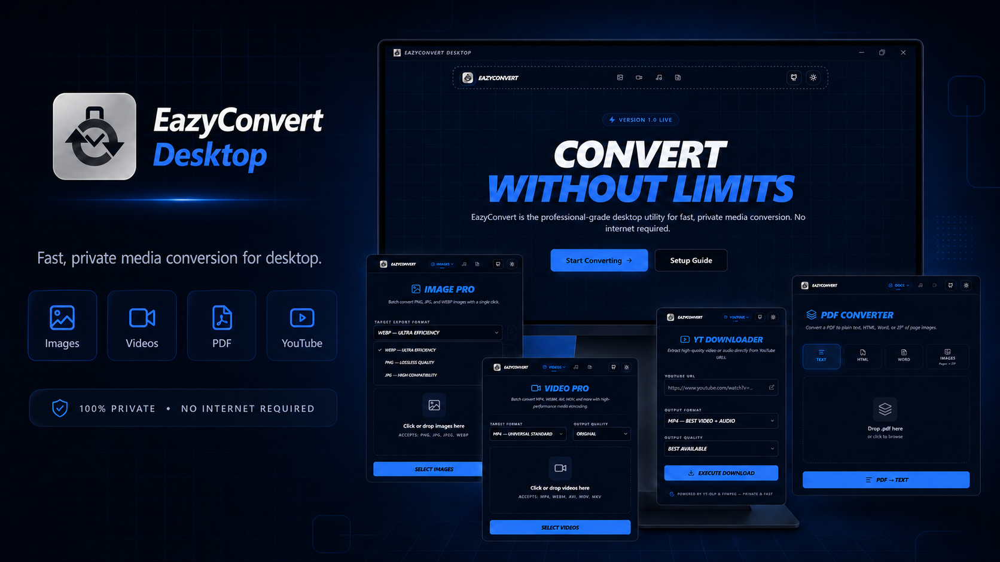
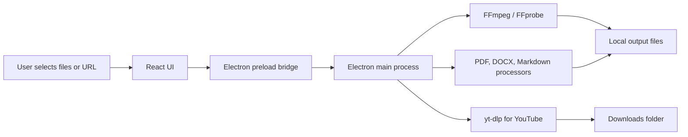
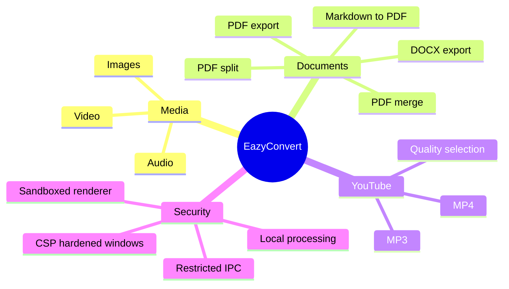
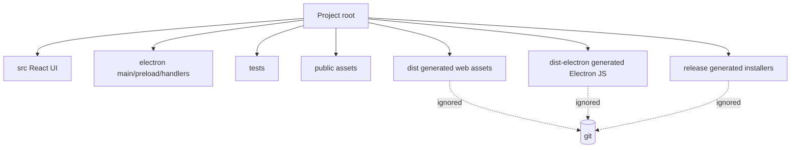

# EazyConvert



EazyConvert is a desktop file conversion app for Windows, macOS, and Linux. It runs conversion work locally on your device using bundled conversion engines, so common image, video, audio, PDF, Word, and Markdown workflows do not require cloud uploads.

The app is built with Electron, React, TypeScript, Vite, FFmpeg, pdf-lib, Mammoth, Marked, Turndown, and yt-dlp.

## Use Cases

- Convert images between PNG, JPG, JPEG, and WEBP.
- Convert video between MP4, WEBM, AVI, MOV, and MKV.
- Convert audio between MP3, WAV, OGG, AAC, FLAC, and M4A.
- Merge and split PDFs.
- Convert images to PDF.
- Extract PDF text.
- Convert PDFs to HTML, DOCX, and page-image ZIP archives.
- Convert Word documents to HTML, TXT, PDF, Markdown, and JSON.
- Convert Markdown to PDF.
- Download supported YouTube media for personal, lawful use.

## How It Works



## Feature Map



## Install

### Windows

1. Download `EazyConvert Setup 1.0.0.exe` from the GitHub release.
2. Run the installer.
3. If Windows SmartScreen appears, choose **More info** then **Run anyway** if you trust the release.
4. Launch EazyConvert from the Start menu or desktop shortcut.

### macOS

1. Download the `.dmg` build from the GitHub release when available.
2. Open the DMG and drag EazyConvert into Applications.
3. If macOS blocks launch because the app is not notarized, right-click the app and choose **Open**.

### Linux

1. Download the `.AppImage` build from the GitHub release when available.
2. Mark it executable.
3. Run it directly.

```bash
chmod +x EazyConvert*.AppImage
./EazyConvert*.AppImage
```

## Verify Download

Each release should include a SHA256 checksum. On Windows:

```powershell
Get-FileHash -Algorithm SHA256 "EazyConvert Setup 1.0.0.exe"
```

Compare the hash with `SHA256SUMS.txt` or the checksum listed in the GitHub release notes.

## Development

### Requirements

- Node.js 20+
- npm

### Commands

```bash
npm install
npm run dev
npm run lint
npm run build
```

### Project Layout



## Included Runtime Tools and Libraries

### Bundled / Runtime Engines

- **FFmpeg** via `ffmpeg-static`: media conversion.
- **FFprobe** via `ffprobe-static`: media metadata and duration.
- **yt-dlp** via `yt-dlp-exec`: YouTube format lookup and downloads.

### Document Processing

- **pdf-lib**: PDF merge, split, generation, and manipulation.
- **pdf-parse**: PDF text extraction.
- **pdfjs-dist**: PDF page rendering for image/HTML output.
- **mammoth**: DOCX to HTML/text conversion.
- **html-to-docx**: HTML to DOCX conversion.
- **marked**: Markdown parsing.
- **turndown**: HTML to Markdown conversion.
- **jszip**: ZIP output for rendered PDF images.

### App Framework

- **Electron**: desktop shell and native integration.
- **React** and **React DOM**: UI.
- **Vite**: frontend build tooling.
- **TypeScript**: type checking.
- **Tailwind CSS**: styling.
- **Radix UI**: accessible UI primitives.
- **Framer Motion**: UI animation.
- **Lucide React**: icons.
- **Zod** and **React Hook Form**: form validation and state.

## Security Notes

EazyConvert is designed to keep normal conversion workflows local. The renderer runs with `nodeIntegration: false`, `contextIsolation: true`, and Electron sandboxing enabled. File work is routed through constrained IPC handlers. Document conversion windows use restrictive CSP, disabled JavaScript where practical, and navigation/window-open blocking.

This does not make untrusted files risk-free. Media and document parsers are complex software. Treat files from unknown sources carefully, keep the app updated, and avoid converting files you do not trust.

## YouTube Downloader Warning

The YouTube downloader is provided for personal and lawful use only. You are responsible for following YouTube's Terms of Service, copyright law, and local law. Do not use EazyConvert to download, redistribute, or bypass access controls for content you do not have rights to use.

YouTube behavior may change over time. If downloads fail, update dependencies or wait for upstream yt-dlp fixes.

## Third-Party Package Notes

- FFmpeg, yt-dlp, Electron, Chromium, React, and other dependencies are separate open-source projects with their own licenses and security practices.
- Some package behavior depends on platform codecs, OS policies, and upstream service changes.
- Windows YouTube downloads may require the Microsoft Visual C++ Redistributable on fresh systems.
- Generated release files are intentionally ignored by git. Upload installers and checksums through GitHub Releases instead of committing them.

## License

MIT. See [LICENSE](./LICENSE).
